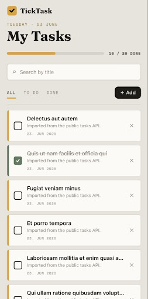
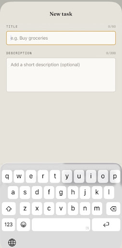
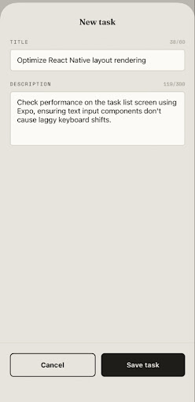
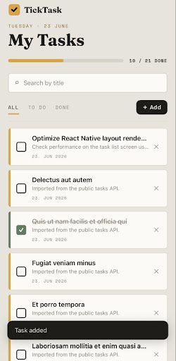
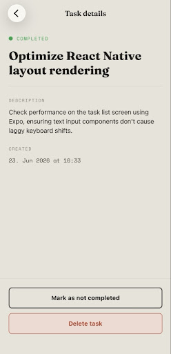
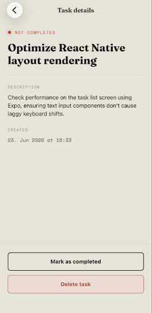
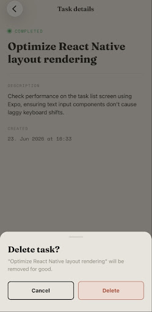
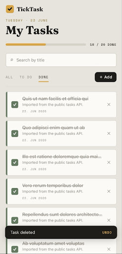

# TickTask — React Native Technical Task

**TickTask** is a simple mobile app to manage a small list of personal tasks,
built with **React Native (Expo)** and JavaScript for the PRITECH technical task.

Add tasks, mark them completed, view details, delete (with undo), search and
filter, and everything is saved on the device. On first launch the list is
seeded with tasks fetched from a public API.

---

## Demo

▶️ **[Watch a short screen recording](screenshots/demo.mov)** — launch, add, complete, details, search/filter, and delete with undo.

## Screenshots

<table>
  <tr>
    <td align="center"><b>Task list</b><br></td>
    <td align="center"><b>Add a task</b><br></td>
    <td align="center"><b>Filled form</b><br></td>
  </tr>
  <tr>
    <td align="center"><b>Task added</b><br></td>
    <td align="center"><b>Details — completed</b><br></td>
    <td align="center"><b>Details — not completed</b><br></td>
  </tr>
  <tr>
    <td align="center"><b>Delete confirmation</b><br></td>
    <td align="center"><b>Delete with undo</b><br></td>
    <td></td>
  </tr>
</table>

---

## Features

**Core requirements**
- 📋 Task list screen
- ➕ Add a new task (with input validation)
- ✅ Mark a task as completed / not completed
- 🗑️ Delete a task (custom confirmation sheet)
- 🔍 Task details screen
- 🈳 Empty, loading and error states handled
- 🌐 Fetches data from a public API and uses it in the app

**Bonus (all implemented)**
- 🔎 Search tasks by title
- 🎛️ Filter tasks by status (All / To do / Done)
- 💾 Tasks stored locally on the device (`AsyncStorage`)
- 🧭 Navigation between screens (React Navigation stack)

**Extra polish**
- 🎬 Animated intro screen with a custom sound
- 🔔 Toast notifications with **Undo** on delete
- 📄 Pagination (10 tasks per page)
- ✨ Smooth animations (list reflow, progress meter, live status dot)
- 🎨 Custom app icon and visual identity

---

## Task data model

Each task has the fields required by the brief:

| Field         | Type       | Description                          |
| ------------- | ---------- | ------------------------------------ |
| `id`          | string     | Unique id                            |
| `title`       | string     | Task title (entered by the user)     |
| `description` | string     | Short description (optional)         |
| `completed`   | boolean    | Status: completed or not completed   |
| `createdAt`   | ISO string | Date the task was created            |

---

## Tech choices (and why)

- **Expo** — the officially recommended way to start a React Native app, and it
  lets the project run on a phone in under a minute with no Android Studio / Xcode
  setup. Keeps the project easy to run locally, as the task asks.
- **React Navigation (native stack)** — moving between the list, details and
  add-task screens.
- **Context + a custom `useTasks` hook** — one source of truth for tasks, shared
  by every screen without prop-drilling. Persistence and the API seed live here,
  so screens stay focused on UI.
- **AsyncStorage** — to persist tasks between app launches.
- **JavaScript** and small reusable components — to keep the code clean and avoid
  unnecessary complexity, as the task requests.

### How the public API is used

On the **first launch only** (when the device has no saved tasks yet), the app
fetches tasks from
[`jsonplaceholder.typicode.com/todos`](https://jsonplaceholder.typicode.com/todos),
maps them into the app's task shape and uses them to pre-populate the list. After
that, your own saved tasks take over. The fetch has proper **loading**, **error**
and **retry** states. See [`src/api/tasksApi.js`](src/api/tasksApi.js) and
[`src/context/TasksContext.js`](src/context/TasksContext.js).

---

## Project structure

```
src/
  api/
    tasksApi.js          # Fetch + map seed tasks from the public API
  components/            # Reusable UI pieces
    Button.js
    ConfirmDialog.js     # Slide-up delete confirmation sheet
    EmptyState.js
    FilterTabs.js
    Input.js
    Pagination.js
    ProgressMeter.js     # Animated progress bar
    SearchBar.js
    SplashIntro.js       # Animated intro screen
    StatusBadge.js       # Live (pulsing) status dot
    TaskItem.js
    Toast.js             # Bottom snackbar
  context/
    TasksContext.js      # Tasks state, actions, persistence, API seed
    ToastContext.js      # Toast/snackbar provider
  navigation/
    AppNavigator.js      # Stack navigator
  screens/
    TaskListScreen.js    # List + search + filter + pagination + states
    AddTaskScreen.js     # Create task form + validation
    TaskDetailsScreen.js # Single task details + actions
  theme/
    colors.js            # Shared color palette
    fonts.js             # Typography roles
  utils/
    date.js              # Date formatting helpers
    storage.js           # AsyncStorage wrapper
    validation.js        # Task form validation rules
App.js                   # Providers, fonts, intro + entry point
```

---

## Getting started

### Prerequisites
- [Node.js](https://nodejs.org/) (v18 or newer)
- The **Expo Go** app on your phone
  ([iOS](https://apps.apple.com/app/expo-go/id982107779) /
  [Android](https://play.google.com/store/apps/details?id=host.exp.exponent)),
  or an Android/iOS emulator.

### Install
```bash
npm install
```

### Run
```bash
npm start
```
Then:
- **On your phone:** scan the QR code with Expo Go (Android) or the Camera app (iOS).
- **Android emulator:** press `a`
- **iOS simulator (macOS):** press `i`

> If your phone shows "could not connect to the server", make sure the phone and
> computer are on the same Wi-Fi, or run `npx expo start --tunnel`.

---

## What was implemented

All core requirements plus every bonus item:

- Functional components and hooks throughout (`useState`, `useEffect`, `useMemo`,
  `useCallback`, `useRef`, plus a custom `useTasks` hook).
- A reusable component set (`Button`, `Input`, `TaskItem`, `SearchBar`,
  `FilterTabs`, `StatusBadge`, `EmptyState`, `ConfirmDialog`, `Toast`,
  `Pagination`, `ProgressMeter`).
- Input validation on the add-task form (required title, min/max length, live
  character counters).
- Search by title and filter by status, combined, with pagination.
- Local persistence with `AsyncStorage` so tasks survive app restarts.
- A meaningful public-API fetch with loading / error / retry handling.
- Empty states for "no tasks yet" and "nothing matches your search/filter".
- Stack navigation between three screens.

---

## Notes

- Tasks persist on the device. To see the API seed again, delete all tasks and
  reload the app, or clear the app's data.
- No backend or database to set up — the app runs entirely on the device and only
  *reads* from the public API.
- Asset generators (intro sound, app icon) live in [`scripts/`](scripts/) and can
  be re-run with `node`.
